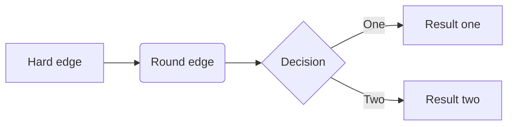
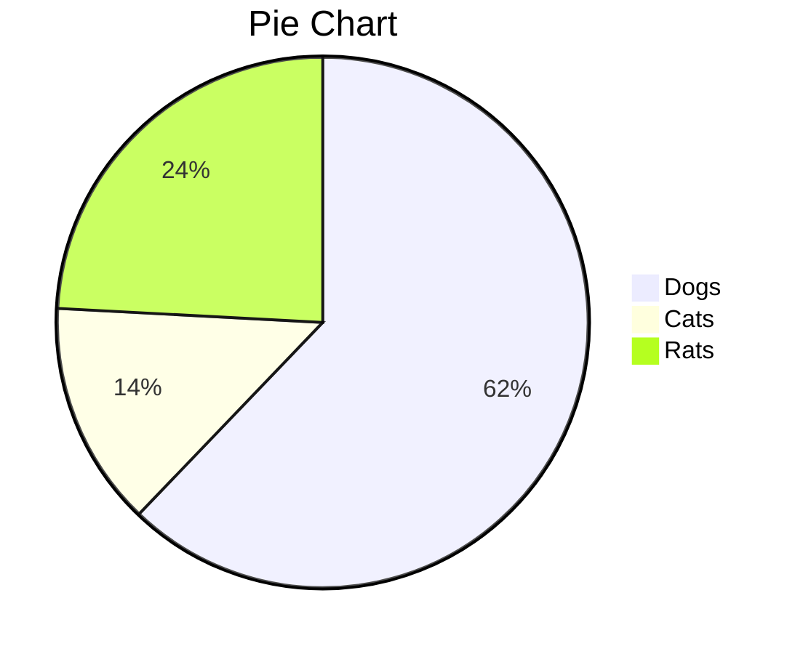
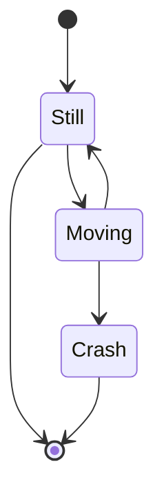

# test-documentation-service-to-delete

Test service to be deleted

## Systems

- [Headlines V2](https://github.com/tamarakaufler/test-documentation-service-to-delete/blob/master/docs/headlines-v2/arc42_template.md)

- [Content App](https://github.com/tamarakaufler/test-documentation-service-to-delete/blob/master/docs/content-app/arc42_template.md)

- [Requirements](#requirements)
- [Development Tooling](#development-tooling)
- [Development Tips](#development-tips)
  - [Local DB containers](#manage-local-docker-db-containers-for-development-purposes)
- [Monitoring](#monitoring)
- [Debugging](#debugging)
- [Dashboards](#operational-dashboards)

## Requirements

Please ref to [Requirements page on confluence](https://aaaaaaa.atlassian.net/wiki/spaces/BE/pages/2149777431/).
