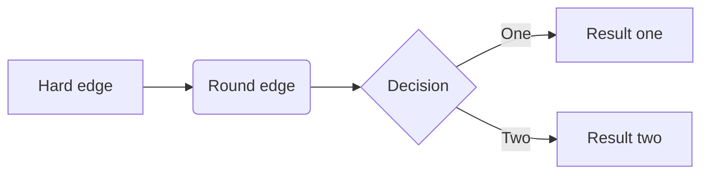
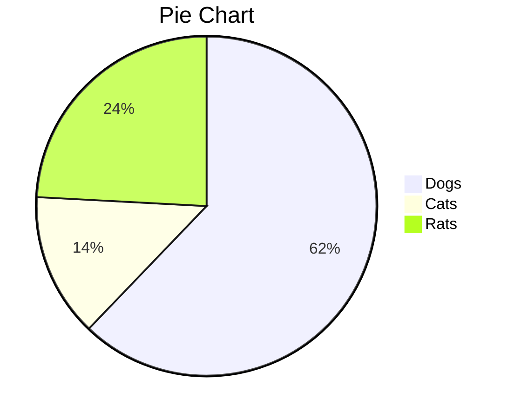
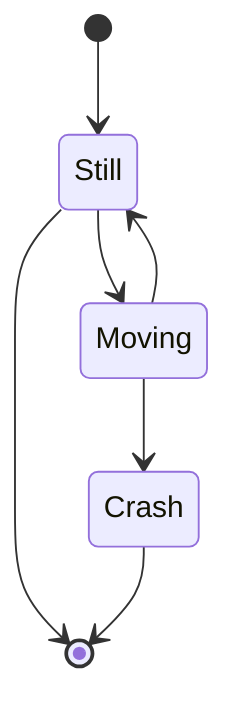

# test-documentation-service-to-delete

## Mermaid diagrams

```mermaid
graph LR
A[Hard edge] -->B(Round edge)
    B --> C{Decision}
    C -->|One| D[Result one]
    C -->|Two| E[Result two]
```

```mermaid
pie
    title Pie Chart
    "Dogs" : 386
    "Cats" : 85
    "Rats" : 150
```

```mermaid
stateDiagram
    [*] --> Still
    Still --> [*]

    Still --> Moving
    Moving --> Still
    Moving --> Crash
    Crash --> [*]
```
